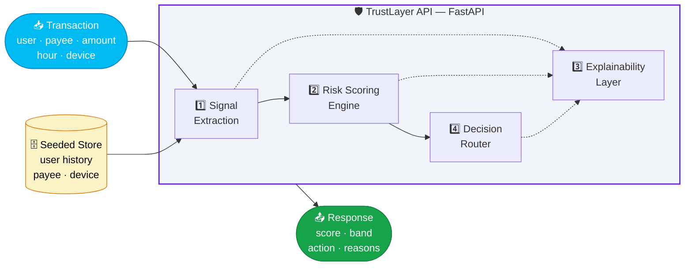
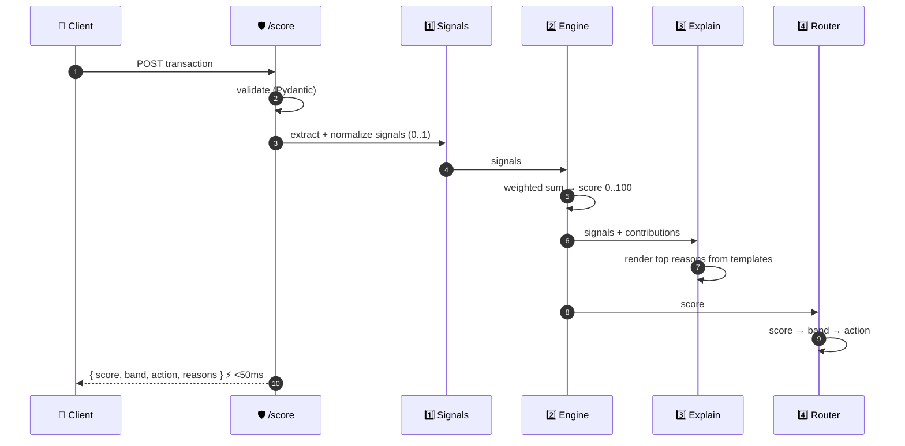

<div align="center">

# 🛡️ TrustLayer

### An explainable, real-time risk engine for UPI

**Trust *before* the money moves — not insurance *after*.**

<br/>

[](https://buildforindia.paytm.com/)
[](#-how-it-fits-the-theme)
[](#-whats-already-built)


<br/>

`@Sarvam` · `@HackCulture` · **#BuildForIndia**

</div>

<div align="center">
<br/>

> 🏆 Extends **Risk Radar**, the trust-scoring agent from *Asli Meesho* — a platform I solo-built that reached the **Top 20 of 36,300+ registrants** at Meesho's ScriptedByHer 2.0 hackathon.

**🔗 Repo + Demo:** _[(https://github.com/sreyadattagupta/asli_meesho)]_

</div>

---

<div align="center">

### 📑 Table of Contents

[Problem](#-the-problem) • [Solution](#-the-solution) • [Theme Fit](#-how-it-fits-the-theme) • [Architecture](#-architecture) • [API](#-api) • [Quickstart](#-quickstart) • [Structure](#-project-structure) • [Roadmap](#-roadmap)

</div>

---

## 🔴 The Problem

Since **April 2026**, every UPI transaction in India requires a **second layer of verification** by regulation — OTP, biometric, or device approval, on top of your PIN. A real, necessary security upgrade. But right now that extra step is **completely blind**.

Every user gets the **same prompt** — whether they're paying their electricity board for the hundredth time, or sending ₹9,000 to a brand-new payee at 3am from an unfamiliar device. No distinction. No explanation. You're asked to verify again, with no idea *why this payment* triggered it.

> 💔 That's **friction without trust** — the kind that makes people screenshot their bank statement and call support instead of trusting the app.

It sits on a bigger gap: **Paytm's existing fraud protection is reactive.** It's insurance — it pays you back *after* you've been scammed. Nothing steps in *before* the money moves and says, in plain language, *"this looks different from your usual activity, and here's why."*

<table>
<tr>
<th>⚠️ The Gap</th>
<th>😐 Today</th>
<th>💸 The Cost</th>
</tr>
<tr>
<td><b>Blind friction</b></td>
<td>Same step-up for everyone, every time</td>
<td>Users distrust the app, flood support</td>
</tr>
<tr>
<td><b>Reactive defense</b></td>
<td>Fraud caught <i>after</i> money moves</td>
<td>Loss already happened; refund ≠ prevention</td>
</tr>
<tr>
<td><b>No explanation</b></td>
<td>"Transaction declined" / silent prompt</td>
<td>User can't tell a real block from a glitch</td>
</tr>
</table>

---

## 🟢 The Solution

**TrustLayer scores every transaction in real time** against signals that actually mean something, then turns the mandatory second verification step from a blind tax into a **transparent, personalized trust decision**.

Instead of a flat "verify again," the user sees:

> ⚠️ **Flagged** — this is a **new payee**, and the amount is **3× above** what you typically send.

Risk drives the response. The mandated step-up doesn't disappear — it becomes **earned and explained**, right-sized to actual risk instead of applied flat to everyone.

<div align="center">

| Risk Band | Score | Action | User Experience |
|:---------:|:-----:|:------:|:----------------|
| 🟢 **LOW** | `0 – 39` | **Approve** | Sails through — friction minimized where regulation allows |
| 🟡 **MEDIUM** | `40 – 74` | **Step-up** | Verify — *and see the one reason it was asked* |
| 🔴 **HIGH** | `75 – 100` | **Hold** | Held, with plain-language reasoning — not a wall of "declined" |

</div>

**✨ What makes it different**

- ⚡ **Proactive, not reactive** — intervenes *before* the money moves.
- 💬 **Explainable by construction** — every score ships with the human-readable reasons that produced it. Explainability is the output, not a bolt-on.
- 👤 **Personal** — scored against *your* history, not a global rule. Your normal is the baseline.
- 🔍 **Auditable** — rule-weighted scoring a compliance team can read, with a clean seam to upgrade to ML later.

---

## 🎯 How It Fits the Theme

<table>
<tr>
<td width="50%" valign="top">

### 👥 Track 1 — Payments for Millions
*Smarter, safer, more personal*

Upgrades the mandated second factor on all three axes the theme names:

- 🚀 **Speed** — skip / minimize friction for low-risk payments
- 🤝 **Trust** — a plain reason every single time it asks
- 🎨 **Personalization** — scored against *your* behavioral history

Moves Paytm from *reactive insurance* → **proactive, explainable prevention.**

</td>
<td width="50%" valign="top">

### 🏪 Track 2 — Growth for SMBs
*TrustLayer for Business*

The same engine, pointed at the merchant side:

- 🛡️ **Chargeback & scam shield** — flag suspicious *incoming* payments before goods ship
- ⭐ **Reputation as an asset** — a clean record lowers friction for the SMB's own customers → fewer abandoned checkouts
- 📋 **Plain-language risk digest** — *"3 payments this week looked unusual, here's why"*

</td>
</tr>
</table>

> 🔧 **One risk engine, two surfaces:** safer payments for users, fewer losses and smoother checkout for the SMBs who serve them.

---

## 🏗️ Architecture

### System Overview

TrustLayer is a **stateless scoring service**. A transaction goes in; a **score + band + action + plain-language reasons** come out. Four modules, each swappable, connected in a single pass.



### Request Lifecycle



### The Four Modules

<div align="center">

| # | Module | Responsibility | Input → Output |
|:-:|--------|----------------|----------------|
| 1️⃣ | **Signal Extraction** | Turn a raw transaction + history into meaningful, normalized signals | Transaction, records → `signals {name → 0..1}` |
| 2️⃣ | **Risk Scoring Engine** | Combine signals into one 0–100 risk score | Signals → `score`, contributions |
| 3️⃣ | **Explainability Layer** | Convert score drivers into user-facing reasons | Signals + contributions → `reasons[]` |
| 4️⃣ | **Decision Router** | Map score → band → action | Score → `band`, `action` |

</div>

> 🧩 **Design rule:** modules communicate through plain data (signals, score), not internals. Swapping the scoring engine for an ML model requires **zero** changes to extraction, explainability, or routing — *the seam is the contract.*

### Signals

Each signal is computed from the user's own history and normalized: `0.0` (totally normal) → `1.0` (maximally anomalous).

<div align="center">

| Signal | ❓ Question | ⚙️ How it's computed |
|--------|------------|---------------------|
| 🆕 **Payee novelty** | Is this payee new to *you*? | `1.0` if never paid; decays toward `0` as prior successful payments accumulate |
| 📈 **Amount deviation** | Is this amount unusual for you? | How far above your typical send (per-payee, else per-category), by ratio / z-score |
| 🕐 **Timing & device** | Odd hour or unknown device? | Distance of hour from your active window + whether `device_id` is known |
| ⭐ **Payee reputation** | Bad track record? | Network-level dispute / complaint rate against the payee (inverted trust) |

</div>

> ➕ New signals plug in the same way: **compute → normalize → attach a reason template.** A signal with no reason template is *incomplete* — explainability is non-negotiable.

### Scoring Model

Deliberately **rule-weighted**, not a black box — a fintech trust decision must be auditable by a compliance reviewer.

```
score = clamp( 100 × Σ (weightᵢ × signalᵢ),  0, 100 )
```

<div align="center">

| Signal | Weight |
|--------|:------:|
| 🆕 Payee novelty | `0.30` |
| 📈 Amount deviation | `0.30` |
| 🕐 Timing & device | `0.20` |
| ⭐ Payee reputation | `0.20` |

</div>

Each signal's **contribution** (`weightᵢ × signalᵢ`) is retained and passed to the explainability layer, so reasons are ranked by *how much they actually moved the score* — the user sees the real driver first.

> 🔌 The whole engine sits behind one interface — `score(signals) → ScoreResult`. **Roadmap:** swap rule weights for a learned model behind that same interface, router and API untouched.

### Decision Router

Pure, deterministic mapping — easy to test, easy to explain to a regulator.

```
  score < 40      →  🟢 low     →  approve   (minimize / skip step-up where allowed)
  40 ≤ score < 75 →  🟡 medium  →  step-up   (mandated 2nd factor + shown reason)
  score ≥ 75      →  🔴 high    →  hold      (block + full reasoning)
```

> Thresholds live in config — not magic numbers scattered through the code.

### Explainability Layer

Turns the signals that fired into short, human sentences from templates:

<div align="center">

| Signal fired | 💬 Rendered reason |
|--------------|-------------------|
| 🆕 Payee novelty high | *"This is a new payee — you haven't paid them before."* |
| 📈 Amount deviation high | *"The amount is 3× above what you typically send."* |
| 🕐 Timing anomaly | *"This payment is at an unusual hour for you (3am)."* |
| 📱 Device unknown | *"This device isn't one you normally pay from."* |
| ⭐ Payee reputation low | *"This payee has recent complaints from other users."* |

</div>

> Reasons are **ranked by contribution** and capped (top N) — the user gets the signal, not a wall of text.

---

## 🔌 API

### `POST /score`

<table>
<tr>
<th width="50%">📥 Request</th>
<th width="50%">📤 Response</th>
</tr>
<tr>
<td valign="top">

```json
{
  "user_id": "u1",
  "payee_id": "new_payee_xyz",
  "amount": 9000,
  "hour": 3,
  "device_id": "dev_new"
}
```

</td>
<td valign="top">

```json
{
  "score": 88,
  "band": "high",
  "action": "hold",
  "reasons": [
    "This is a new payee — you haven't paid them before.",
    "The amount is 3× above what you typically send.",
    "This payment is at an unusual hour for you (3am)."
  ],
  "signals": {
    "payee_novelty": 1.0,
    "amount_deviation": 0.82,
    "timing_device": 0.9,
    "payee_reputation": 0.4
  }
}
```

</td>
</tr>
</table>

> 📖 Interactive Swagger docs auto-served at **`http://localhost:8000/docs`**

---

## ✅ What's Already Built

Not just a concept — a **working, tested** version exists:

- ✔️ **FastAPI backend** with a risk-scoring engine, a decision router, and an explainability layer
- ✔️ Runs against **seeded transaction data** (no external DB needed for the demo)
- ✔️ **Demonstrated end-to-end** ⬇️

<div align="center">

| Scenario | Signals | Score | Result |
|----------|---------|:-----:|--------|
| 🟢 **Normal payment** | known payee · usual amount · familiar device | `low` | ✅ **Auto-approved** |
| 🔴 **Risky payment** | new payee · 3× amount · 3am · unknown device | `high` | 🛑 **Held + real explanation** |

</div>

---

## 🧰 Tech Stack

<div align="center">


</div>

- Rule-weighted scoring engine with a **clean seam for a future ML upgrade**
- Seeded synthetic dataset for a **reproducible demo**

---

## 🚀 Quickstart

```bash
git clone <your-repo-url> trustlayer && cd trustlayer
python -m venv .venv && source .venv/bin/activate    # Windows: .venv\Scripts\activate
pip install -r requirements.txt
uvicorn app.main:app --reload
```

Open 👉 **`http://localhost:8000/docs`**

<details>
<summary><b>🧪 Try it — copy-paste demo requests</b></summary>

<br/>

**🟢 Low-risk** — known payee, normal amount, familiar device → `approve`
```bash
curl -X POST http://localhost:8000/score \
  -H "Content-Type: application/json" \
  -d '{"user_id":"u1","payee_id":"electricity_board","amount":850,"hour":19,"device_id":"dev_known"}'
```

**🔴 High-risk** — new payee, 3× normal, 3am, unknown device → `hold` + reasons
```bash
curl -X POST http://localhost:8000/score \
  -H "Content-Type: application/json" \
  -d '{"user_id":"u1","payee_id":"new_payee_xyz","amount":9000,"hour":3,"device_id":"dev_new"}'
```

</details>

---

## 📁 Project Structure

```
trustlayer/
├── app/
│   ├── main.py          # 🌐 FastAPI app + /score endpoint (thin orchestration)
│   ├── models.py        # 📦 Pydantic request/response schemas
│   ├── signals.py       # 1️⃣ Signal Extraction
│   ├── engine.py        # 2️⃣ Risk Scoring Engine — score(signals) → result
│   ├── explain.py       # 3️⃣ Explainability Layer — reason templates
│   ├── router.py        # 4️⃣ Decision Router — score → band → action
│   ├── config.py        # ⚙️ weights + thresholds (tunable, not hardcoded)
│   └── data/
│       └── seed.py      # 🌱 seeded users / payees / devices
├── tests/
│   └── test_flow.py     # 🔒 locks the two canonical demo transactions
├── requirements.txt
├── README.md

```

---

## 🗺️ Roadmap

- [ ] 🤖 Swap rule weights for a learned model behind the existing scoring seam
- [ ] 📊 Per-user adaptive baselines (rolling behavioral profile)
- [ ] 🏪 Merchant-side **TrustLayer for Business** endpoints
- [ ] 🌐 Federated payee-reputation signal across the network
- [ ] ⚡ Latency budget **< 50ms p99** for inline UPI use
- [ ] 🔁 Feedback loop: user *"this was me"* / *"this wasn't"* retrains baselines

---

<div align="center">

## 💡 Why It Matters

UPI moves **billions** of transactions. The April 2026 mandate added a second lock to every door.

### **TrustLayer makes each lock explain itself** —
### so security stops feeling like suspicion, and starts feeling like the app has your back.

<br/>

---

**Built with ❤️ by [@sreyadattagupta](dsreya799@gmail.com) for Paytm Build for India**

`#BuildForIndia` · `@Sarvam` · `@HackCulture`

</div>
